# Database Design

**Status: finalised through Phase 4 (P4-13), extended at P5-02.** Covers every table through
migration `0011_pos.sql` — 32 tables, all applied and grant-verified against the real pinned
MariaDB instance, its exact declared types read live from `information_schema` rather than
transcribed from the migration files (CLAUDE.md section 6.3: a migration is what was asked for,
not necessarily what the server is running). First drafted at P2-12 (22 tables through `0006`),
extended at P3-02 (`0008`), finalised at P4-13 with the four Procurement tables
`0009_receiving.sql` and the three Inventory tables `0010_counts-and-adjustments.sql` added, and
extended again at P5-02 with the four POS tables `0011_pos.sql` adds. Every fact this document
states about the schema is checked on every test run by `DatabaseDesignDocumentationTests` — a
drift check in the P2-12/P3-08 shape, so this document cannot silently fall out of date with the
server the way a sentence in an evidence file can (`plan.md`'s Phase 3 lesson, `tasks.md` line
20). **This closes G-21** (spec section 23's gap register: "Data model lacked invariants and
precision").

The `SalesReturns`, `SalesReturnItems` and `CashierClosings` tables spec section 12's POS entity
group names are still Phase 5 work not yet landed (`SalesReturns`/`SalesReturnLines` are P5-03;
closing data lives on `CashierSessions` itself rather than a separate `CashierClosings` table —
see §3.6) — called out here so their absence reads as "not built", not "forgotten".

**Scope note.** This system is an **academic prototype**. MariaDB is supplied through XAMPP
because the course requires it (ADR-000), and XAMPP is documented by Apache Friends as intended
for development environments. Nothing in this document should be read as a production-readiness
claim.

---

## 1. Conventions

These hold for every table below; they are stated once here rather than repeated per table.

| Convention | Rule | Why |
|---|---|---|
| Character set / collation | `utf8mb4` / `utf8mb4_unicode_ci`, stated explicitly on every `CREATE DATABASE`/`CREATE TABLE` | The server default here is `utf8mb4_general_ci`, not `unicode_ci` — inheriting it silently gets the wrong collation (ADR-003). |
| Engine | `InnoDB` | Foreign keys and transactions; MariaDB's default anyway, stated explicitly. |
| Surrogate keys | `INT AUTO_INCREMENT`, except three `CHAR(36)` GUID-shaped values | MariaDB 10.4 has no `UUID` column type (added 10.7) and this store's scale needs no distributed identifiers (ADR-003, ADR-002). `CHAR(36)` is used only where a value is genuinely GUID-shaped: `StockMovements.CorrelationId`, `PriceHistory.CorrelationId`, `MaintenanceLocks.CorrelationId`, `IdempotencyKeys.KeyValue`. |
| Table name casing | Lowercase in every grant file | `@@lower_case_table_names = 1` on Windows (ADR-003.1) — `StockMovements` in a migration is stored and granted as `stockmovements`. |
| Timestamps | `DATETIME(6)`, always UTC in storage | Displayed in the configured store time zone, **Asia/Manila** (spec section 12, CLAUDE.md section 5). Every write uses `UTC_TIMESTAMP(6)`, never client clock time. |
| Money | `DECIMAL(19,4)` | ADR-004, confirmed by round-trip measurement (`12345678901234.5678` exactly) — never `DOUBLE`/`SINGLE`/floating point, storage or calculation. |
| Quantity | `DECIMAL(19,3)` | ADR-004, same measurement basis (`0.001` exactly). |
| Decimal scale enforcement | API boundary, not the database | `STRICT_TRANS_TABLES` (ADR-003.2/P1-04/P1-05) enforces column **width**, not **scale** — an over-scale value is silently rounded (`Note 1265`), not rejected. Validated and rounded to storage scale by the API before the parameter is bound (`Merchandising.Domain.DecimalScaleGuard`, ADR-004.1). |
| Isolation level | `READ COMMITTED`, set per connection | The server default here is `REPEATABLE-READ`, not `READ COMMITTED` — `ConnectionFactory` sets it explicitly on every connection (ADR-006), never assumed. |

---

## 2. Entity-relationship diagram

Every table that exists through `0011_pos.sql`. `SalesReturns`/`SalesReturnLines` (P5-03) are
Phase 5 work not yet landed and are not shown.

```mermaid
erDiagram
    Roles ||--o{ UserRoles : "has"
    Users ||--o{ UserRoles : "holds"
    Users ||--o{ Sessions : "authenticates"
    Users ||--o{ StockMovements : "acts as"
    Users ||--o{ AuditLogs : "acts as"
    Users ||--o{ PriceHistory : "acts as"
    Users ||--o{ MaintenanceLocks : "requests/releases"
    Users ||--o{ SystemSettings : "last changed by"

    Categories ||--o{ Products : "classifies"
    Brands ||--o{ Products : "classifies"
    Units ||--o{ Products : "classifies"
    Products ||--o| StockBalances : "one balance"
    Products ||--o{ StockMovements : "ledger for"
    Products ||--o{ PriceHistory : "history for"
    Products ||--o{ ProductBarcodes : "alternate codes"

    Suppliers ||--o{ PurchaseOrders : "supplies"
    Users ||--o{ PurchaseOrders : "requests"
    Users ||--o{ PurchaseOrders : "approves"
    PurchaseOrders ||--o{ PurchaseOrderLines : "has lines"
    Products ||--o{ PurchaseOrderLines : "ordered as"

    PurchaseOrders ||--o{ Receipts : "received against"
    Users ||--o{ Receipts : "receives"
    Receipts ||--o{ ReceiptLines : "has lines"
    PurchaseOrderLines ||--o{ ReceiptLines : "receives against"
    Products ||--o{ ReceiptLines : "received as"

    Receipts ||--o{ PurchaseReturns : "returned from"
    Users ||--o{ PurchaseReturns : "requests/approves"
    PurchaseReturns ||--o{ PurchaseReturnLines : "has lines"
    ReceiptLines ||--o{ PurchaseReturnLines : "returns against"
    Products ||--o{ PurchaseReturnLines : "returned as"

    Users ||--o{ StockCounts : "counts/approves"
    StockCounts ||--o{ StockCountLines : "has lines"
    Products ||--o{ StockCountLines : "counted as"

    Products ||--o{ StockAdjustments : "adjusted for"
    Users ||--o{ StockAdjustments : "requests/approves"

    Users ||--o{ CashierSessions : "opens/closes"
    CashierSessions ||--o{ Sales : "sold under"
    Users ||--o{ Sales : "rings"
    Sales ||--o{ SaleLines : "has lines"
    Products ||--o{ SaleLines : "sold as"
    Sales ||--o{ SalePayments : "paid by"

    Users {
        int Id PK
        varchar Username UK
        varchar PasswordHash
        int FailedLoginAttempts
        datetime LockedUntilUtc
        tinyint IsActive
    }
    Roles {
        int Id PK
        varchar Name UK
    }
    UserRoles {
        int UserId PK
        int RoleId PK
        int AssignedByUserId FK
    }
    Sessions {
        int Id PK
        char TokenHash UK
        int UserId FK
        datetime ExpiresAtUtc
    }
    PermissionPolicies {
        int Id PK
        varchar PolicyName UK
    }
    Products {
        int Id PK
        varchar Sku UK
        varchar Barcode
        varchar ActiveBarcode UK "generated, active only"
        int CategoryId FK
        int BrandId FK
        int UnitId FK
        decimal Price
        decimal Cost
        tinyint IsActive
        bigint RowVersion
    }
    Categories {
        int Id PK
        varchar Name UK
    }
    Brands {
        int Id PK
        varchar Name UK
    }
    Units {
        int Id PK
        varchar Name UK
    }
    ProductBarcodes {
        int Id PK
        int ProductId FK
        varchar Barcode UK
    }
    PriceHistory {
        int Id PK
        int ProductId FK
        varchar ChangedField
        decimal OldValue
        decimal NewValue
        int ActorUserId FK
        char CorrelationId
    }
    StockBalances {
        int ProductId PK
        decimal Quantity
        bigint RowVersion
    }
    StockMovements {
        int Id PK
        int ProductId FK
        decimal Delta
        decimal QuantityBefore
        decimal QuantityAfter
        int ActorUserId FK
        char CorrelationId
    }
    AuditLogs {
        int Id PK
        int ActorUserId FK
        varchar Action
        varchar Target
        varchar Result
        char CorrelationId
    }
    IdempotencyKeys {
        int Id PK
        varchar Scope
        char KeyValue
    }
    SystemSettings {
        varchar SettingKey PK
        varchar SettingValue
        int UpdatedByUserId FK
    }
    SchemaMigrations {
        varchar MigrationId PK
        char Checksum
        tinyint Succeeded
    }
    BackupLogs {
        int Id PK
        varchar Result
        char Sha256
        char CorrelationId
    }
    MaintenanceLocks {
        int Id PK
        int RequestedByUserId FK
        int ReleasedByUserId FK
        tinyint IsActive UK "generated, 1 or NULL"
    }
    Suppliers {
        int Id PK
        varchar Name UK
        tinyint IsActive
        bigint RowVersion
    }
    PurchaseOrders {
        int Id PK
        varchar OrderNumber UK
        int SupplierId FK
        varchar Status
        int RequestedByUserId FK
        int ApprovedByUserId FK
        datetime SubmittedAtUtc
        datetime ApprovedAtUtc
        bigint RowVersion
    }
    PurchaseOrderLines {
        int Id PK
        int PurchaseOrderId FK
        int LineNumber UK
        int ProductId FK
        decimal OrderedQuantity
        decimal PurchaseCost
        decimal ReceivedQuantity
        bigint RowVersion
    }
    Receipts {
        int Id PK
        int PurchaseOrderId FK
        int ReceivedByUserId FK
        datetime ReceivedAtUtc
        varchar ReferenceNumber UK
    }
    ReceiptLines {
        int Id PK
        int ReceiptId FK
        int PurchaseOrderLineId FK
        int ProductId FK
        decimal QuantityReceived
        decimal Cost
    }
    PurchaseReturns {
        int Id PK
        int ReceiptId FK
        int RequestedByUserId FK
        int ApprovedByUserId FK
        varchar Status
        varchar ReferenceNumber UK
        bigint RowVersion
    }
    PurchaseReturnLines {
        int Id PK
        int PurchaseReturnId FK
        int ReceiptLineId FK
        int ProductId FK
        decimal QuantityReturned
        decimal Cost
        tinyint RemovesStock
    }
    StockCounts {
        int Id PK
        varchar Status
        int CountedByUserId FK
        int ApprovedByUserId FK
        bigint RowVersion
    }
    StockCountLines {
        int Id PK
        int StockCountId FK
        int ProductId FK
        decimal CountedQuantity
        decimal SystemQuantity
        decimal Variance
    }
    StockAdjustments {
        int Id PK
        int ProductId FK
        decimal QuantityVariance
        varchar Reason
        int RequestedByUserId FK
        int ApprovedByUserId FK
        tinyint ExceedsThreshold
        varchar Status
        bigint RowVersion
    }
    CashierSessions {
        int Id PK
        int OpenedByUserId FK
        int ClosedByUserId FK
        decimal OpeningFloat
        decimal DeclaredCash
        decimal CalculatedCash
        decimal CashVariance
        varchar Status
        int OpenSessionOwner UK "generated, Open only"
        bigint RowVersion
    }
    Sales {
        int Id PK
        int CashierSessionId FK
        int CashierUserId FK
        decimal Total
        varchar Status
        char CorrelationId
    }
    SaleLines {
        int Id PK
        int SaleId FK
        int ProductId FK
        decimal Quantity
        decimal UnitPrice
        decimal Cost
        decimal LineTotal
    }
    SalePayments {
        int Id PK
        int SaleId FK
        varchar Method
        decimal Amount
        decimal TenderedAmount
        decimal ChangeAmount
    }
```

`Suppliers` gained its first consumer at `0008`: `PurchaseOrders.SupplierId`, an unadorned
foreign key, so MariaDB's default `RESTRICT` prevents deleting a supplier any order references
(`ERROR 1451`, proven in `evidence/phase-3/p3-02-schema.txt`).

---

## 3. Data dictionary

Grouped the way spec section 12 groups them. Each table names the migration that created it and
the grants file that gave `merch_api` its runtime privileges (§4 explains the grant model itself).

### 3.1 Identity / security

| Table | Migration → Grants | Key columns | Notes |
|---|---|---|---|
| `Users` | `0001` (+ lockout cols `0002`) → `0002`, `0003` | PK `Id`; UK `Username` | `PasswordHash` only, never plaintext (spec section 9). `FailedLoginAttempts`/`LockedUntilUtc` implement the five-attempt lockout (`AuthenticationPolicy`). `IsActive` — deactivation, never delete. |
| `Roles` | `0001` → `0002` | PK `Id`; UK `Name` | Seeded as **data**, not an enum: `SuperAdmin`, `Admin`, `ProcurementOfficer`, `InventoryClerk`, `Cashier` (spec section 9). |
| `UserRoles` | `0001` → `0002` (INSERT+DELETE, no UPDATE) | PK (`UserId`,`RoleId`); FK → `Users`, `Roles`, `Users` (`AssignedByUserId`) | Revoking a role **deletes** the row — a tombstone that still satisfies a join is not a revoked role. |
| `Sessions` | `0002` → `0003` (INSERT+DELETE, no UPDATE) | PK `Id`; UK `TokenHash`; FK → `Users` | Opaque server-side token (ADR-005); only its SHA-256 hash is stored. Logout deletes the row rather than soft-revoking it. |
| `PermissionPolicies` | `0005` → `0007` (**no grant** — read-only catalog) | PK `Id`; UK `PolicyName` | Catalog table backing `PolicyRegistry` (ADR-017); nothing writes to it yet, so `merch_api` gets database-level `SELECT` only. |
| `AuditLogs` | `0001` → `0002` (**INSERT only**) | PK `Id`; FK `ActorUserId` → `Users` | **Append-only, ledger.** See §4. |

### 3.2 Product master

| Table | Migration → Grants | Key columns | Notes |
|---|---|---|---|
| `Products` | `0001` (+cols `0006`) → `0002`, `0008` | PK `Id`; UK `Sku`; UK `ActiveBarcode` (generated); FK `CategoryId`/`BrandId`/`UnitId` | `ActiveBarcode` is a `VIRTUAL` generated column (`CASE WHEN IsActive=1 THEN Barcode ELSE NULL END`) with an ordinary `UNIQUE KEY` on it — MariaDB 10.4 has no partial/filtered unique index, so this is how "unique **active** barcode" (spec section 12) is expressed without one (ADR-018). Deactivation is the only removal story; no `DELETE` grant exists for `merch_api`. |
| `Categories` | `0006` → `0008` | PK `Id`; UK `Name` | Permanent reference data, no lifecycle of its own. Referenced rows are protected by the plain FK (`RESTRICT`, MariaDB's default — no `ON DELETE` clause). |
| `Brands` | `0006` → `0008` | PK `Id`; UK `Name` | Same shape as `Categories`. |
| `Units` | `0006` → `0008` | PK `Id`; UK `Name` | Unit of measure a product is stocked/sold in (e.g. `pcs`, `box`, `kg`). |
| `ProductBarcodes` | `0006` → `0008` | PK `Id`; UK `Barcode`; FK `ProductId` → `Products` | Alternate scannable codes beyond `Products.Barcode`, globally unique regardless of the owning product's active state. |
| `PriceHistory` | `0006` → `0008` (**INSERT only**) | PK `Id`; FK `ProductId` → `Products`, `ActorUserId` → `Users`; `CHECK (ChangedField IN ('Price','Cost'))` | **Append-only, ledger.** See §4. One row per changed field, not per change event — a single price+cost update writes two rows. |
| `StockBalances` | `0001` → `0002` | PK `ProductId` (also FK → `Products`) | One balance per product, single stock pool (spec section 12). `RowVersion`/`UpdatedAtUtc` exist for the conditional `UPDATE` (ADR-006). |
| `StockMovements` | `0001` → `0002` (**INSERT only**) | PK `Id`; FK `ProductId` → `Products`, `ActorUserId` → `Users` | **Append-only, ledger.** See §4. Delta + before/after quantity + reason + actor + correlation ID, per spec section 12. |

### 3.3 Configuration / operations

| Table | Migration → Grants | Key columns | Notes |
|---|---|---|---|
| `SystemSettings` | `0001` → `0002` | PK `SettingKey`; FK `UpdatedByUserId` → `Users` | Key/value configuration, one row per key. Seeded values: `backup.retentionCount`, `backup.offHostVolumeLabel`, `backup.directory` (`0003`); `maintenance.clientMessage` (`0004`) — all via `INSERT IGNORE`, so a re-run never resets an operator-tuned value. |
| `SchemaMigrations` | bootstrapped by `MigrationRunner` itself, before `0001` runs → **no grant to `merch_api`** | PK `MigrationId` | Owned entirely by `merch_migrator`. `merch_api` cannot write here — a stray row would let the runner believe a migration was applied when it was not (ADR-008). |
| `BackupLogs` | `0003` → `0004` (**INSERT only**, granted to `merch_backup`, not `merch_api`) | PK `Id` | **Append-only, ledger** (by the ADR-013 default, not a rule written here — `merch_backup` never held a write privilege beyond this one `INSERT`). One row per backup *attempt*: `Result` is `Succeeded` / `Partial` / `Failed`, not a boolean — a dump that verified but could not copy off-host is neither. |
| `MaintenanceLocks` | `0004` → `0005` (INSERT+UPDATE, no DELETE) | PK `Id`; FK `RequestedByUserId`/`ReleasedByUserId` → `Users`; UK `IsActive` (generated) | **Not** append-only — a release is an `UPDATE` of the acquiring row (operational state, not a ledger; the immutable trail lives in `AuditLogs`). "One active lock at a time" is enforced by a `PERSISTENT` generated column (`1` while held, `NULL` once released) under a plain `UNIQUE KEY` — MariaDB's unique index treats every `NULL` as distinct, so released rows never collide and a second concurrent acquisition is refused by the database itself (measured: `ERROR 1062` on a second unreleased row), not by a check-then-insert race. |
| `IdempotencyKeys` | `0001` → `0002` (INSERT+UPDATE+DELETE) | PK `Id`; UK (`Scope`,`KeyValue`) | ADR-007: insert-first strategy — a command claims its key before doing work, and the committed response payload is stored and replayed verbatim on a repeat. `DELETE` is granted for an eventual expiry sweep. |

### 3.4 Procurement

| Table | Migration → Grants | Key columns | Notes |
|---|---|---|---|
| `Suppliers` | `0007` → `0009` (INSERT+UPDATE, no DELETE) | PK `Id`; UK `Name` | Same lifecycle shape as `Products`: `IsActive` + `RowVersion`, deactivation is the only removal story. Contact fields (`ContactName`/`Phone`/`Email`/`Address`) are free-text and nullable — a supplier record created before every detail is known must still be usable. `PurchaseOrders` (`0008`) is its first consumer. |
| `PurchaseOrders` | `0008` → `0010` (INSERT+UPDATE, no DELETE) | PK `Id`; UK `OrderNumber`; FK `SupplierId` → `Suppliers`, `RequestedByUserId`/`ApprovedByUserId` → `Users`; IX `Status`, `CreatedAtUtc` | **Not** append-only, and the grants file argues why rather than assuming it: a ledger records what *happened*, a purchase order records what is *intended*, and spec §10.1's status machine is a sequence of in-place changes to one row. The immutable trail lives in `AuditLogs`. `Status` stores the **enum name** (ADR-020 §5) under a `CHECK` over the seven spec §10.1 states — and carries `COLLATE utf8mb4_bin`, the one binary-collated column in the schema, because under the table's case-insensitive `utf8mb4_unicode_ci` the `CHECK` accepts `'draft'` and stores it verbatim. `RequestedByUserId` and `ApprovedByUserId` are deliberately two columns: ADR-017 §6's self-approval veto compares them. |
| `PurchaseOrderLines` | `0008` → `0010` (INSERT+UPDATE, no DELETE) | PK `Id`; UK (`PurchaseOrderId`,`LineNumber`); FK → `PurchaseOrders`, `Products` | `OrderedQuantity`/`ReceivedQuantity` `DECIMAL(19,3)`, `PurchaseCost` `DECIMAL(19,4)` captured on the line so a later cost change never restates what was agreed. `ReceivedQuantity` starts at `0.000` and accumulates across partial receipts in Phase 4. `CHECK (ReceivedQuantity <= OrderedQuantity)` enforces spec §12's "receipt quantity bounded by ordered quantity" at the server; spec §10.1's future over-receiving override would need a new migration to relax it. The same product may appear on two lines, so there is deliberately no UK on (`PurchaseOrderId`,`ProductId`). **Removing a line from a `Draft` has no route** — no `DELETE` grant, and no Phase 3 card needs one; see the `0010` header. |
| `Receipts` | `0009` → `0011` (**INSERT only**) | PK `Id`; UK `ReferenceNumber`; FK `PurchaseOrderId` → `PurchaseOrders`, `ReceivedByUserId` → `Users` | Records something that **happened** — spec section 11's "Goods received" row commits once; no endpoint edits a receipt afterward, the same `CreatedAtUtc`-only, no-`RowVersion` shape as `StockMovements`/`AuditLogs`. `ReferenceNumber` is the receiving clerk's own document number, distinct from the ADR-007 idempotency key (which lives only in `IdempotencyKeys`, never on the row it protects). |
| `ReceiptLines` | `0009` → `0011` (**INSERT only**) | PK `Id`; FK `ReceiptId` → `Receipts`, `PurchaseOrderLineId` → `PurchaseOrderLines`, `ProductId` → `Products`; `CHECK (QuantityReceived > 0)`, `CHECK (Cost >= 0)` | `Cost` is captured on the line, the same as `PurchaseOrderLines.PurchaseCost` — the actual received cost can differ from what was ordered, and spec section 10.2 requires historical transactions to keep captured cost even after a product is deactivated. No unique key on (`ReceiptId`,`PurchaseOrderLineId`) — nothing forbids two lines on one receipt against the same order line. |
| `PurchaseReturns` | `0009` → `0011` (INSERT, UPDATE — `Status`/`ApprovedByUserId`/`ApprovedAtUtc`/`RowVersion`) | PK `Id`; UK `ReferenceNumber`; FK `ReceiptId` → `Receipts`, `RequestedByUserId`/`ApprovedByUserId` → `Users`; IX `Status`, `ReturnedAtUtc`; `CHECK (Status IN ('Requested','Approved','Rejected'))` | Records something that is **decided** — the approval state changes in place, the same `PurchaseOrders`/`Status` shape. `Status` carries `COLLATE utf8mb4_bin` for the identical reason `PurchaseOrders.Status` does: under `utf8mb4_unicode_ci` the `CHECK` would accept `'requested'` and store it verbatim. `RequestedByUserId`/`ApprovedByUserId` are two columns, kept available even before a self-approval rule is decided for returns. One return points at exactly one receipt — spec section 10.1 never describes a return spanning goods received on two different receipts. |
| `PurchaseReturnLines` | `0009` → `0011` (**INSERT only**) | PK `Id`; FK `PurchaseReturnId` → `PurchaseReturns`, `ReceiptLineId` → `ReceiptLines`, `ProductId` → `Products`; `CHECK (QuantityReturned > 0)`, `CHECK (Cost >= 0)` | `RemovesStock` (`TINYINT(1)`, default `1`) is spec section 10.1's "whether stock is removed" — a resalable return decrements stock the normal way, a defective item already written off by a prior adjustment does not. No database `CHECK` bounds `QuantityReturned` against "received quantity less prior returns" — that bound is an aggregate over every prior sibling row for the same `ReceiptLineId`, which a MariaDB `CHECK` (evaluated one row at a time) cannot express; enforced at the API (P4-08), computed from committed rows. |

**On the names `Receipts`/`ReceiptLines`/`PurchaseReturns`/`PurchaseReturnLines`.** Spec §12's
entity list writes `GoodsReceipts`/`GoodsReceiptItems`/`PurchaseReturns`/`PurchaseReturnItems`;
`0009_receiving.sql`'s own header, `plan.md` §7 and the P4-02 card all write the shorter *receipt*
form and *Lines*, not *Items* — the same delegation spec §12 grants and P3-02 already exercised
for `PurchaseOrderLines`. Settled here as `Receipts`/`ReceiptLines`/`PurchaseReturns`/`PurchaseReturnLines`.

### 3.5 Inventory — counts and adjustments

| Table | Migration → Grants | Key columns | Notes |
|---|---|---|---|
| `StockCounts` | `0010` → `0012` (INSERT, UPDATE — `Status`/`ApprovedByUserId`/`ApprovedAtUtc`/`RowVersion`) | PK `Id`; FK `CountedByUserId`/`ApprovedByUserId` → `Users`; IX `Status`, `CountedAtUtc`; `CHECK (Status IN ('Open','Closed','Approved','Rejected'))` | Four statuses model the whole lifecycle now, including two (`Approved`/`Rejected`) not yet driven by an endpoint — the same forward-naming precedent `PurchaseOrderStatus` set at P3-02, so a later card wires a transition rather than a migration. `Status` carries `COLLATE utf8mb4_bin` for the same reason `PurchaseOrders.Status` does. `CountedByUserId` is not nullable — a count session cannot exist without someone performing it. |
| `StockCountLines` | `0010` → `0012` (**INSERT only**) | PK `Id`; FK `StockCountId` → `StockCounts`, `ProductId` → `Products`; `CHECK (CountedQuantity >= 0)`, `CHECK (SystemQuantity >= 0)` | `SystemQuantity` and `Variance` are captured **at count time**, never recomputed — "the whole point of a count is what was true then" (`0010`'s own header). No `CHECK` ties `Variance` to `CountedQuantity - SystemQuantity`: the API computes and writes all three together in one `INSERT` (P4-09), so there is no path where they could disagree once written. |
| `StockAdjustments` | `0010` → `0012` (INSERT, UPDATE — `Status`/`ApprovedByUserId`/`RowVersion`) | PK `Id`; FK `ProductId` → `Products`, `RequestedByUserId`/`ApprovedByUserId` → `Users`; IX `Status`, `CreatedAtUtc`; `CHECK (QuantityVariance <> 0)`, `CHECK (Status IN ('Pending','Approved','Rejected','Applied'))` | `RequestedByUserId`/`ApprovedByUserId` are two columns so the threshold-approval rule (ADR-017 §6) can compare them, the same shape `PurchaseOrders` and `PurchaseReturns` use. `QuantityVariance` is **signed** — an adjustment's whole purpose is a correction that can move stock up or down, unlike a receipt or sale quantity. `ExceedsThreshold` (`TINYINT(1)`) is captured at request time, not derived by a `CHECK` against `SystemSettings`' threshold value — a MariaDB 10.4 `CHECK` cannot reference another table, and the threshold itself can change after the request without silently reinterpreting a past decision. Carries **no** `StockCountId` — nothing in spec section 10.2 requires an adjustment to originate from a count; if a later card needs that link, it is a new numbered migration. |

### 3.6 POS

| Table | Migration → Grants | Key columns | Notes |
|---|---|---|---|
| `CashierSessions` | `0011` → `0013` (INSERT, UPDATE — `Status`/`ClosedByUserId`/`ClosedAtUtc`/`DeclaredCash`/`CalculatedCash`/`CashVariance`/`RowVersion`) | PK `Id`; UK `OpenSessionOwner` (generated); FK `OpenedByUserId`/`ClosedByUserId` → `Users`; IX `Status`, `OpenedAtUtc`; `CHECK (Status IN ('Open','Closed'))` | The one mutable POS table — a session opens, then closes with declared/calculated cash and variance filled in (spec section 10.3), the same in-place-status shape `PurchaseOrders`/`PurchaseReturns`/`StockCounts`/`StockAdjustments` use. `OpenSessionOwner` is a `VIRTUAL` generated column (`CASE WHEN Status='Open' THEN OpenedByUserId ELSE NULL`) under an ordinary `UNIQUE KEY` — the identical ADR-018 trick `Products.ActiveBarcode` uses, scoped to a different predicate — so a cashier cannot hold two `Open` sessions at once, enforced by the database rather than by an API check (measured: a second concurrent `Open` insert for the same `OpenedByUserId` fails `ERROR 1062`). Carries no running `TotalSalesAmount`/`TransactionCount`: every total is a query over committed `Sales`/`SalePayments` rows, never a maintained counter that could drift from the ledger it summarizes (the same principle behind ADR-021's reconciliation). |
| `Sales` | `0011` → `0013` (**INSERT only**) | PK `Id`; FK `CashierSessionId` → `CashierSessions`, `CashierUserId` → `Users`; IX `Status`, `CreatedAtUtc`; `CHECK (Total >= 0)`, `CHECK (Status IN ('Completed','Cancelled'))` | Records something that **happened**, the same `Receipts` shape — no `RowVersion`, no `UpdatedAtUtc`, `CreatedAtUtc` only. Spec section 10.3: "Completed sales are never edited or deleted." There is no persisted in-progress row: the atomic sale (P5-07) writes a `Completed` header, its lines, payments, stock movements, balance changes, session totals and audit row together, in one transaction, or none of them — "cancelled only before completion" is therefore a client-side, pre-API-call fact, never a database transition. `Cancelled` is declared but driven by no card in this phase, the same forward-naming precedent `StockCounts`/`StockAdjustments` set at P4-03. `CashierUserId` is a direct column, not reached only through `CashierSessionId` — spec section 14's "Sales by cashier" report names cashier as a required column, the same reasoning every transactional line in this schema already captures `ProductId` directly. |
| `SaleLines` | `0011` → `0013` (**INSERT only**) | PK `Id`; FK `SaleId` → `Sales`, `ProductId` → `Products`; `CHECK (Quantity > 0)`, `CHECK (UnitPrice >= 0)`, `CHECK (Cost >= 0)`, `CHECK (LineTotal >= 0)` | `UnitPrice`/`Cost` are the **captured, effective** values at sale time — never a join to `Products.Price`/`Cost` (spec section 10.3: "so future price changes do not alter historical sales analysis" — `plan.md` section 7 names this the phase's key design call). `LineTotal` is likewise captured, not derived by a later `SELECT` (ADR-004.1: totals are derived from already-rounded components, never rounded independently of them) — the API computes and rounds it once, at construction (`Merchandising.Domain.Sales.SaleLine`, P5-01). |
| `SalePayments` | `0011` → `0013` (**INSERT only**) | PK `Id`; FK `SaleId` → `Sales`; `CHECK (Method IN ('Cash','Card','EWallet'))`, `CHECK (Amount >= 0)`, `CHECK` pairing `TenderedAmount`/`ChangeAmount` to `Method = 'Cash'` | `Method` carries `COLLATE utf8mb4_bin`, the same defect class `PurchaseOrders`/`PurchaseReturns`/`StockCounts`/`StockAdjustments`' `Status` columns already guard against — under the table's case-insensitive collation the `CHECK` would accept `'cash'` and store it verbatim. `TenderedAmount`/`ChangeAmount` are nullable and **cash only** — required and consistent (`TenderedAmount >= Amount`, `ChangeAmount = TenderedAmount - Amount`) when `Method = 'Cash'`, `NULL` otherwise — preserving what the customer handed over and got back for a reprinted receipt, mirroring the `CashTenderResult` shape P5-01 already built in `Domain`. Card/e-wallet rows are **recorded**, never claimed as externally authorized (G-24). |

`SalesReturns`/`SalesReturnLines` (Phase 5's remaining POS tables, P5-03) do not exist in the
schema yet. Listed here so this document's absence of them reads as "not built", not "forgotten".

### 3.7 Foreign keys and delete behaviour

Every foreign key in this schema is an **unadorned** `FOREIGN KEY` — no migration through `0011`
has ever written an `ON DELETE`/`ON UPDATE` clause — so MariaDB's default applies uniformly:
**`RESTRICT` on both delete and update, on every one of the 47 foreign keys this schema carries**,
confirmed live against `information_schema.REFERENTIAL_CONSTRAINTS` (`DatabaseDesignDocumentationTests.
EveryForeignKey_IsRestrictOnDeleteAndUpdate`, re-run on every suite pass — not a one-time count).
This is spec section 12's requirement stated as a database fact: *"Foreign-key behavior must
prevent accidental deletion of records referenced by sales, receipts, returns, movements, or
audit events."*

| Table | Column | References |
|---|---|---|
| `UserRoles` | `UserId`, `RoleId`, `AssignedByUserId` | `Users`, `Roles`, `Users` |
| `Sessions` | `UserId` | `Users` |
| `AuditLogs` | `ActorUserId` | `Users` |
| `Products` | `CategoryId`, `BrandId`, `UnitId` | `Categories`, `Brands`, `Units` |
| `ProductBarcodes` | `ProductId` | `Products` |
| `PriceHistory` | `ProductId`, `ActorUserId` | `Products`, `Users` |
| `StockBalances` | `ProductId` | `Products` |
| `StockMovements` | `ProductId`, `ActorUserId` | `Products`, `Users` |
| `SystemSettings` | `UpdatedByUserId` | `Users` |
| `MaintenanceLocks` | `RequestedByUserId`, `ReleasedByUserId` | `Users`, `Users` |
| `PurchaseOrders` | `SupplierId`, `RequestedByUserId`, `ApprovedByUserId` | `Suppliers`, `Users`, `Users` |
| `PurchaseOrderLines` | `PurchaseOrderId`, `ProductId` | `PurchaseOrders`, `Products` |
| `Receipts` | `PurchaseOrderId`, `ReceivedByUserId` | `PurchaseOrders`, `Users` |
| `ReceiptLines` | `ReceiptId`, `PurchaseOrderLineId`, `ProductId` | `Receipts`, `PurchaseOrderLines`, `Products` |
| `PurchaseReturns` | `ReceiptId`, `RequestedByUserId`, `ApprovedByUserId` | `Receipts`, `Users`, `Users` |
| `PurchaseReturnLines` | `PurchaseReturnId`, `ReceiptLineId`, `ProductId` | `PurchaseReturns`, `ReceiptLines`, `Products` |
| `StockCounts` | `CountedByUserId`, `ApprovedByUserId` | `Users`, `Users` |
| `StockCountLines` | `StockCountId`, `ProductId` | `StockCounts`, `Products` |
| `StockAdjustments` | `ProductId`, `RequestedByUserId`, `ApprovedByUserId` | `Products`, `Users`, `Users` |
| `CashierSessions` | `OpenedByUserId`, `ClosedByUserId` | `Users`, `Users` |
| `Sales` | `CashierSessionId`, `CashierUserId` | `CashierSessions`, `Users` |
| `SaleLines` | `SaleId`, `ProductId` | `Sales`, `Products` |
| `SalePayments` | `SaleId` | `Sales` |

---

## 4. The append-only grant model (ADR-013)

CLAUDE.md section 5 requires `StockMovements` and `AuditLogs` to be append-only, "enforced by
database grants as well as by policy." MariaDB unions privileges across scopes and has no `DENY`,
so a database-level `GRANT UPDATE ON merchandising.*` could never be subtracted from for one
table — the only way to make the guarantee real is to never grant `UPDATE`/`DELETE` at the
database level in the first place, and add writes back **one table at a time**, after the fact,
naming exactly what each table needs.

**Three identities, not one, and they are not interchangeable:**

| Identity | Holds | Used by |
|---|---|---|
| `merch_migrator` | `SELECT, INSERT, UPDATE, DELETE, CREATE, ALTER, DROP, INDEX, REFERENCES` on the whole schema — the only account with DDL — plus `LOCK TABLES` (`0006_restore-grants.sql`, needed only because `mysqldump`'s restore output locks each table before loading it) | `Merchandising.Maintenance`, during `migrate`/`create-user`/`seed`/`seed-demo`/`restore`, and nowhere else |
| `merch_api` | Database-level `SELECT` only; every write is a per-table `GRANT` added after the owning migration | The running API service, always |
| `merch_backup` | `SELECT, LOCK TABLES, SHOW VIEW, EVENT, TRIGGER` plus `INSERT` on `backuplogs` only (`0004_backup-grants.sql`, a deliberate, recorded widening of the original ADR-013 grant) | `Merchandising.Maintenance backup`, run from Task Scheduler as its own identity |

**Reaching for the wrong identity fails loudly and specifically:** `ERROR 1142` (privilege
denied), not a subtle bug — that is the point.

**`merch_api`'s per-table grants, one row per migration → grants pair:**

| Table | Grant | Table | Grant |
|---|---|---|---|
| `stockmovements` | INSERT only | `pricehistory` | INSERT only |
| `auditlogs` | INSERT only | `backuplogs` | *(none — `merch_backup` writes it)* |
| `schemamigrations` | *(none — `merch_migrator` owns it)* | `permissionpolicies` | *(none yet — read-only catalog)* |
| `users` | INSERT, UPDATE | `roles` | INSERT, UPDATE |
| `products` | INSERT, UPDATE | `categories` | INSERT, UPDATE |
| `brands` | INSERT, UPDATE | `units` | INSERT, UPDATE |
| `stockbalances` | INSERT, UPDATE | `systemsettings` | INSERT, UPDATE |
| `suppliers` | INSERT, UPDATE | `maintenancelocks` | INSERT, UPDATE |
| `productbarcodes` | INSERT, UPDATE, DELETE | `idempotencykeys` | INSERT, UPDATE, DELETE |
| `userroles` | INSERT, DELETE | `sessions` | INSERT, DELETE |
| `purchaseorders` | INSERT, UPDATE | `purchaseorderlines` | INSERT, UPDATE |
| `receipts` | INSERT only | `receiptlines` | INSERT only |
| `purchasereturns` | INSERT, UPDATE | `purchasereturnlines` | INSERT only |
| `stockcounts` | INSERT, UPDATE | `stockcountlines` | INSERT only |
| `stockadjustments` | INSERT, UPDATE | `cashiersessions` | INSERT, UPDATE |
| `sales` | INSERT only | `salelines` | INSERT only |
| `salepayments` | INSERT only | | |

Two absences carry the whole guarantee: `stockmovements` and `auditlogs` are the **only** tables
that receive `INSERT` and nothing else, at any scope, to anyone but `merch_migrator` — the two
CLAUDE.md section 5 names as **permanently** excluded from ever gaining a write-back grant.
`pricehistory` and `backuplogs` follow the identical INSERT-only pattern for the same reason. A
correction to any of these four is a new row — a compensating movement, a new audit entry —
never an edit to an old one.

`receipts`, `receiptlines`, `purchasereturnlines`, `stockcountlines`, `sales`, `salelines` and
`salepayments` are INSERT-only too, but for a narrower reason argued in their own grants files
(`0011`, `0012`, `0013`), not the permanent CLAUDE.md exclusion: each records something that
**happened** and no card in this phase (or any later one named so far) edits it after it is
written — the argument is "nothing needs the write yet," not "this table must never be
writable." Spec section 10.3 makes `sales`/`salelines`/`salepayments`'s case explicitly: "Completed
sales are never edited or deleted." `purchaseorders`, `purchasereturns`, `stockcounts` and
`cashiersessions` are the opposite shape — a status that changes in place — the same reasoning
`0010_purchase-order-grants.sql` gives `purchaseorders` and `0011`/`0012`/`0013` repeat for each
new in-place-status table.

Proven, not asserted: `evidence/phase-1/p1-04a-grant-model-proof.txt` (the original two-table
proof), every phase-2/3/4 card's own evidence (`p2-06-schema.txt`, `p2-08-atomicity.txt`,
`p2-10-suppliers.txt`, `p3-02-schema.txt`, `p4-05-receiving.txt`, `p4-09-stock-counts.txt`, …) —
each re-runs the same `UPDATE`/`DELETE`-must-fail check against its own new table before calling
that card done — and `DatabaseDesignDocumentationTests.MerchApiGrants_MatchTheDocumentedPostureForEveryTable`,
which checks the grant table above against `information_schema.TABLE_PRIVILEGES` on every run.

---

## 5. Migrations

Applied in strict numeric order by `Merchandising.Maintenance migrate`, running as
`merch_migrator`. Each migration's checksum (SHA-256 of its file content) is recorded in
`SchemaMigrations` on first application; a modified already-applied file is refused at startup
rather than silently re-run (`MigrationChecksumMismatchException`, ADR-008) — CLAUDE.md's stop
condition 6 exists for exactly this reason. Grants are always a **separate**, later step run by
hand as `root`, because MariaDB 10.4 rejects a table-level `GRANT` naming a table that does not
exist yet (`ERROR 1146`).

| # | Migration | Grants | Adds |
|---|---|---|---|
| 1 | `0001_foundation.sql` | `0002_post-migration-grants.sql` | `Users`, `Roles` (+seed), `UserRoles`, `Products`, `StockBalances`, `StockMovements`, `AuditLogs`, `IdempotencyKeys`, `SystemSettings`, `SchemaMigrations` |
| 2 | `0002_authentication.sql` | `0003_authentication-grants.sql` | `Users` lockout columns, `Sessions` |
| 3 | `0003_backup.sql` | `0004_backup-grants.sql` | `BackupLogs`, `SystemSettings` seed (backup keys) |
| 4 | `0004_maintenance.sql` | `0005_maintenance-grants.sql` | `MaintenanceLocks`, `SystemSettings` seed (maintenance message) |
| 5 | `0005_identity.sql` | `0007_identity-grants.sql` | `PermissionPolicies` |
| 6 | `0006_product-master.sql` | `0008_product-master-grants.sql` | `Categories`, `Brands`, `Units`, `Products` columns, `ActiveBarcode`, `ProductBarcodes`, `PriceHistory` |
| 7 | `0007_suppliers.sql` | `0009_supplier-grants.sql` | `Suppliers` |
| 8 | `0008_purchase-orders.sql` | `0010_purchase-order-grants.sql` | `PurchaseOrders`, `PurchaseOrderLines` |
| 9 | `0009_receiving.sql` | `0011_receiving-grants.sql` | `Receipts`, `ReceiptLines`, `PurchaseReturns`, `PurchaseReturnLines` |
| 10 | `0010_counts-and-adjustments.sql` | `0012_counts-and-adjustments-grants.sql` | `StockCounts`, `StockCountLines`, `StockAdjustments` |
| 11 | `0011_pos.sql` | `0013_pos-grants.sql` | `CashierSessions`, `Sales`, `SaleLines`, `SalePayments` |

`db/grants/` and `db/migrations/` are two independent numbering sequences, not a matched pair —
`db/grants/0006_restore-grants.sql` grants `merch_migrator` `LOCK TABLES` (a privilege fix
discovered while proving restore against the real production identity, unrelated to any single
migration), which is why the table above pairs migration 5 with grants file `0007`, migration 6
with `0008`, and migration 7 with `0009` rather than matching numbers straight across. From
migration 8 onward the numbering happens to run in step (`0008`→`0010`, `0009`→`0011`,
`0010`→`0012`, `0011`→`0013`) — coincidence of no further `LOCK TABLES`-style fixes since, not a rule.

---

## 6. Seed data

`db/seed/seed-data.json` (P2-11) holds non-secret catalog data only — 5 categories, 3 brands, 3
units, 8 products, 3 suppliers — loaded by `Merchandising.Maintenance seed`, idempotent by each
row's natural key (`Name` for catalog tables, `Sku`/`Name` for products/suppliers). The same
command creates one test account per spec section 9 role (fixed usernames
`superadmin`/`admin`/`procurementofficer`/`inventoryclerk`/`cashier`), with a password generated
per installation and never committed to this repository (ADR-012 requirement 6). `bootstrap.ps1`
runs it automatically as its final step, so a clean clone reaches a working login without manual
SQL.

---

## 7. Retention rules

| Data | Rule |
|---|---|
| `StockMovements`, `AuditLogs`, `PriceHistory` | **Never purged.** No `DELETE` grant exists for any identity except `merch_migrator`; nothing in this codebase calls one. A correction is a new row, forever. |
| `MaintenanceLocks` | Rows are kept forever, released in place (`UPDATE`, never deleted) — the migration's own header calls this "a handful of rows per year," not a retention problem worth solving. |
| `BackupLogs` | Row retention: never purged (same append-only reasoning as the two ledgers). **File** retention is separate and configurable: `SystemSettings.backup.retentionCount` (seeded to `7`) is how many local dump *files* `BackupCommand` keeps on disk, pruning older ones after a successful run — it deletes files, not `BackupLogs` rows. |
| `Sessions` | Deleted outright on logout, not soft-revoked (`0002_authentication.sql`'s own header) — this table is operational state, not a ledger, so CLAUDE.md's append-only rule does not apply to it. |
| `IdempotencyKeys` | `DELETE` is granted for an eventual expiry sweep (not yet implemented as of this draft) — a repeated key must return the original committed result for as long as the key is retained (ADR-007). |
| `PurchaseOrders`, `PurchaseOrderLines`, `Receipts`, `ReceiptLines`, `PurchaseReturns`, `PurchaseReturnLines`, `StockCounts`, `StockCountLines`, `StockAdjustments` | **Never purged.** Spec section 12: "Transactional records are never physically deleted." No identity holds a `DELETE` grant on any of the nine; the four in-place-status tables (`PurchaseOrders`, `PurchaseReturns`, `StockCounts`, `StockAdjustments`) reach their terminal status by `UPDATE`, never by removal. |
| Everything else (`Products`, `Suppliers`, `Categories`, `Brands`, `Units`, `Users`, …) | Master data is **deactivated**, never deleted — no identity holds a `DELETE` grant on any of them. Foreign keys use MariaDB's default `RESTRICT` behavior, so a referenced row cannot be deleted even by `merch_migrator` without first removing the reference. |
